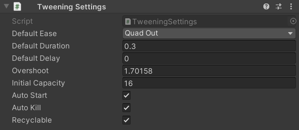

# Settings

The **Tweening** package provides global settings that can be modified. Settings can either be changed through a static class, or through a MonoBehaviour:

- [defaultEase](/api/Zigurous.Tweening/Settings/defaultEase): The default [Ease](/api/Zigurous.Tweening/Ease) assigned to every tween (`Ease.QuadOut`). The ease used by a tween can be set manually if desired.
- [defaultDuration](/api/Zigurous.Tweening/Settings/defaultDuration): The default amount of seconds a tween takes to complete (`0.3`). The duration of a tween can be set manually if desired.
- [defaultDelay](/api/Zigurous.Tweening/Settings/defaultDelay): The default amount of seconds before every tween starts (`0`). The delay of a tween can be set manually if desired.
- [overshoot](/api/Zigurous.Tweening/Settings/overshoot): The overshoot value used in easing functions (`1.70158`).
- [initialCapacity](/api/Zigurous.Tweening/Settings/initialCapacity): The initial amount of tweens memory is allocated for when the system starts (`16`). Additional memory will be allocated as needed.
- [autoStart](/api/Zigurous.Tweening/Settings/autoStart): Automatically starts tweens after being created (`true`). This is can be turned on/off manually per tween if desired.
- [autoKill](/api/Zigurous.Tweening/Settings/autoKill): Automatically kills tweens after being completed (`true`). This is can be turned on/off manually per tween if desired.
- [recyclable](/api/Zigurous.Tweening/Settings/recyclable): Keeps tweens in memory to be re-used after being killed (`true`). This can be turned on/off manually per tween if desired.

<hr/>

## ⚙️ Changing settings with code

Settings can be changed with static properties via the [Settings](/api/Zigurous.Tweening/Settings) class.<br/>
Below are all of the settings and their default values:

```csharp
Settings.defaultEase = Ease.QuadOut;
Settings.defaultDuration = 0.3f;
Settings.defaultDelay = 0f;
Settings.overshoot = 1.70158f;
Settings.initialCapacity = 16;
Settings.autoStart = true;
Settings.autoKill = true;
Settings.recyclable = true;
```

<hr/>

## 🖥️ Changing settings in the editor

The [Settings](/api/Zigurous.Tweening/Settings) class can also be used as a MonoBehaviour added to your scene. This is generally used to provide a simple interface for changing settings in the Unity editor rather than with code. You can, of course, still use this behavior to change settings at runtime if desired, in which case there is a function to set each respective setting.


